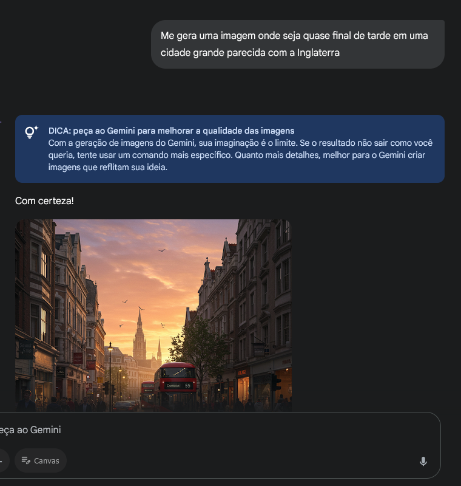
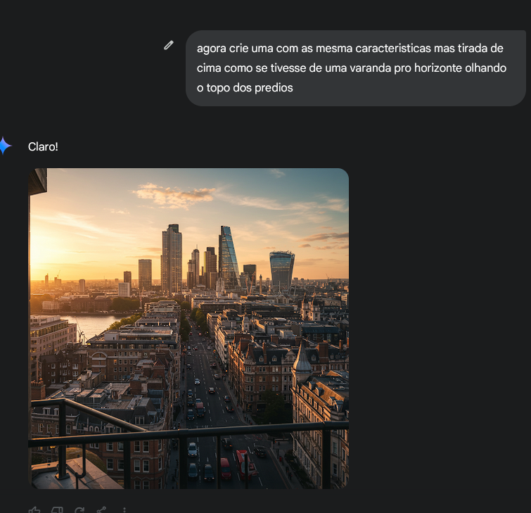

# Desafio Conhecimentos com IA's

Como não tive acesso ao Azure IA, utilizei o **Gemini** para gerar as imagens conforme as solicitações descritas no documento textual na pasta `input`. Seguem abaixo as imagens geradas.

## Imagens Geradas

## Observações

As imagens foram criadas a partir das especificações contidas no documento da pasta `input`. Qualquer dúvida ou sugestão, estou à disposição para mais esclarecimentos.
